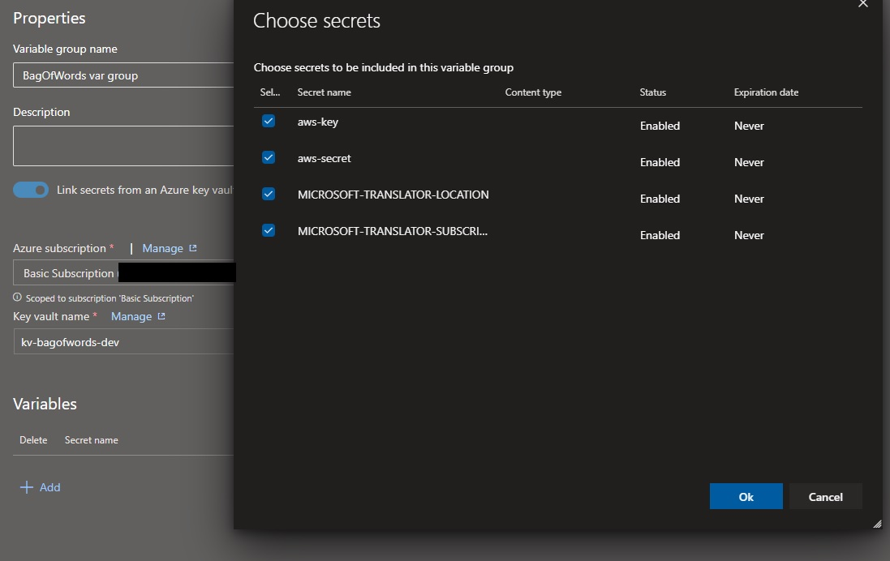
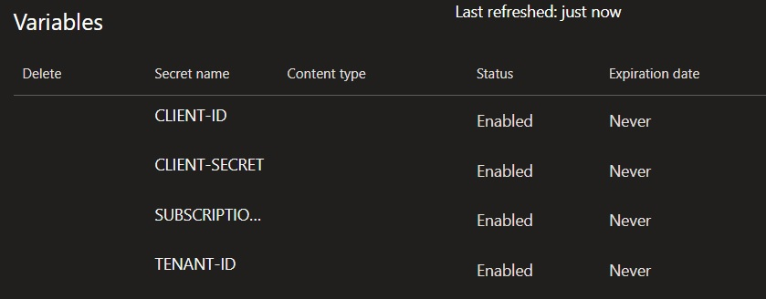

# Bag of Words

Bag of Words is an API that generates random words and also templates to be used on different platforms.
The word definitions are collected from the [Dictionary API](https://dictionaryapi.dev/)

Try it [here](https://4mz6hhf5ed.execute-api.us-east-1.amazonaws.com/dev/word).

## Requirements
* AWS Account
* Azure Account
* [Serverless](https://www.serverless.com/) framework
* NodeJS
* NPM or Yarn

## Config

### Azure Translator
It was used this translator because of the pricing limits
* Create a Translator in the [Azure Portal](https://portal.azure.com/)
* Specify the Resource Group, region, name, and pricing tier (select the F0)
* After the resource is created, access the "Keys and Endpoint"
* Copy the value of "KEY1" and add in the `MICROSOFT_TRANSLATOR_SUBSCRIPTION_KEY` in the `serverless.yml` file
* Fill the `MICROSOFT_TRANSLATOR_LOCATION` with the Location/Region
* Get the link of `Text Translation` and add in the `MICROSOFT_API_COGNITIVE_ENDPOINT`


## Install
Rename the file `serverless-copy.yml`to `serverless.yml`
```
# Install dependencies
npm i

# Install dev dependencies
npm i -D

```
## Test
[http://localhost:3000/dev/word/](http://localhost:3000/dev/word/)

```
//For testing is informing a single random word, but by default, the api will provide 3 words
{
    "words": [
        {
            "word": "Summer",
            "phonetic": "ˈsʌmə",
            "phonetics": [
                {
                    "text": "ˈsʌmə",
                    "audio": "//ssl.gstatic.com/dictionary/static/sounds/20200429/summer--_gb_1.mp3"
                }
            ],
            "origin": "Old English sumor, of Germanic origin; related to Dutch zomer, German Sommer, also to Sanskrit samā ‘year’.",
            "meanings": [
                {
                    "partOfSpeech": "noun",
                    "definitions": [
                        {
                            "definition": "the warmest season of the year, in the northern hemisphere from June to August and in the southern hemisphere from December to February.",
                            "example": "this plant flowers in late summer",
                            "synonyms": [],
                            "antonyms": []
                        }
                    ]
                },
                {
                    "partOfSpeech": "verb",
                    "definitions": [
                        {
                            "definition": "spend the summer in a particular place.",
                            "example": "well over 100 birds summered there in 1976",
                            "synonyms": [],
                            "antonyms": []
                        }
                    ]
                }
            ]
        }
    ]
}
```
### Specific language
[http://localhost:3000/dev/word/de](http://localhost:3000/dev/word/de)
```
//For this example it'll collect Deutsch random words
{
    "words": [
        {
            "word": "Schaden",
            "phonetic": "scháden",
            "phonetics": [
                {
                    "text": "scháden"
                }
            ],
            "origin": "mittelhochdeutsch schaden, althochdeutsch scadōn, zu Schaden",
            "meanings": [
                {
                    "partOfSpeech": "schwaches Verb",
                    "definitions": [
                        {
                            "definition": "für jemanden, etwas von Nachteil sein; einen Verlust, eine Beeinträchtigung darstellen, bewirken",
                            "example": "jemandem geschäftlich schaden",
                            "synonyms": [],
                            "antonyms": []
                        }
                    ]
                }
            ],
            "translation": {
                "text": "Hurt",
                "language": "en"
            }
        }
    ]
}

```
### Templates
* [Slack](http://localhost:3000/dev/word/template/slack)
```
{
    "blocks": [
        {
            "type": "section",
            "text": {
                "type": "mrkdwn",
                "text": "*Word*: Track\n*Example*: Secondary radars that track the aircraft in flight\n*Phonetics*: <https://ssl.gstatic.com/dictionary/static/sounds/20200429/track--_gb_1.mp3|Track>"
            }
        },
        {
            "type": "divider"
        },
        {
            "type": "section",
            "text": {
                "type": "mrkdwn",
                "text": "*Word*: Birth\n*Example*: She birthed five children within ten years\n*Phonetics*: <https://ssl.gstatic.com/dictionary/static/sounds/20200429/birth--_gb_1.mp3|Birth>"
            }
        },
        {
            "type": "divider"
        },
        {
            "type": "section",
            "text": {
                "type": "mrkdwn",
                "text": "*Word*: My\n*Example*: My goodness!\n*Phonetics*: <https://ssl.gstatic.com/dictionary/static/sounds/20200429/my--_gb_1.mp3|My>"
            }
        },
        {
            "type": "divider"
        }
    ]
}
```

## Deploy 
As this project was built with the serverless framework and the provider was set as `AWS`, the project will be deployed in the AWS.
```
npm run deploy
```

## Azure DevOps
In the folder `Azure` it was created the file that is responsible to run the [`Azure Pipelines`](azure/azure-pipelines.yml).

### Terraform (optional)
It was created an terraform script to create the `Key Vault` and the Text Translator in the `Cognitive Services`. It's optional but you can save some time doing it. It's required to rename the file [terraform-copy.tfvars](terraform-main/terraform-copy.tfvars) to `terraform.tfvars` and add the following values:
```
#Can be get using the command `az account show`
subscription_id             = "" #Subscription ID of Azure account
tenant_id                   = "" #homeTenantId
#Values that are set in the App registrations https://support.lacework.com/hc/en-us/articles/360029107274-Gather-the-Required-Azure-Client-ID-Tenant-ID-and-Client-Secret
client_id                   = ""
client_secret               = ""
aws_secret = ""
aws_key = ""
```

Access the directory `terraform-main` and run the commands `terraform init`, `terraform plan` and `terraform apply`.

It was also created an pipleline template to handle with terraform files to create all the environment in the Azure side. The file [deploy-using-tf-kv.yml](azure/templates/deploy-using-tf-kv.yml) it's similar to the [deploy.yml](azure/templates/deploy.yml), the diffrence is that is using the secrets from the Key Vault that was created by the terraform.

### Role assignments on AZ Subscription
* Create a new App Registration or generate a new client secret in the App Registration of the Azure DevOps.
* Open the AZ Subscription that you manage, open the `Access control`, click on `Add` and select `Add role assignment`. Chose `Contribuitor` and on `Members` select the App Registration that is related to your Azure DeVOps.

### Key Vault
First it's needed a KeyVault to store all the secrets needed, so create a new one and add the following secrets:
* Manually
```
* aws-key - AWS key of the user
* aws-secret - AWS secret of the user
* MICROSOFT-TRANSLATOR-LOCATION - location where Microsoft translator is
* MICROSOFT-TRANSLATOR-SUBSCRIPTION-KEY - Key from the Microsoft translator
```
* Terraform
```
* CLIENT-ID - Id of the App registration of the Azure DevOps
* CLIENT-SECRET - Secret of the App registration of the Azure DevOps
* SUBSCRIPTION-ID - Subscription id. Can be get by using `az account show`
* TENANT-ID - Tenant Id. Can be get by using `az account show`
```

### Library
In the `Library` from Azure DevOps, create a new variable group called `BagOfWords var group` (or chose a name that you want), click in the `Link secrets from an Azure key vault variables`. In `Variables`, click on `Add` and select all the secrets from the key vault. Click on save.



<strong>In case you're using the terraform to create the environment on Azure</strong>


### Azure Pipeline
This is the sample of the azure-pipeline.yml. It was created an template file to use as component called [deploy.yml](azure/deploy.yml).
It was also created a diffrent deployment file to handle with the terraform script. The [deploy-using-tf-kv.yml](azure/templates/deploy-using-tf-kv.yml) has all the steps needed to deploy the app.
```
# Node.js
# Build a general Node.js project with npm.
# Add steps that analyze code, save build artifacts, deploy, and more:
# https://docs.microsoft.com/azure/devops/pipelines/languages/javascript

trigger:
  batch: true
  branches:
    include:
    - main
  paths:
    exclude: 
    - README.md
    - LICENSE

# parameters:
#   - name: appName
#     default: "BagOfWords3"
#     type: string

pool:
  vmImage: ubuntu-latest

#You can use this one if you have created the KeyVault and Cognitive Services manually.
variables:
  - group: "BagOfWords var group"

stages:
# You can use this one if you have created the KeyVault and Cognitive Services manually.
  - stage: dev
    condition: succeededOrFailed()
    jobs:
    - template: /azure/templates/deploy.yml
      parameters:
        stageDeployment: dev
        awsSecret: $(aws-secret)
        awsKey: $(aws-key)  
        microsoftLocation: $(MICROSOFT-TRANSLATOR-LOCATION)
        microsoftSubscription: $(MICROSOFT-TRANSLATOR-SUBSCRIPTION-KEY)
        performTests: false

  # - stage: terraform
  #   jobs:
  #   - template: /azure/templates/terraform.yml
  #     parameters:
  #       awsSecret: $(aws-secret)
  #       awsKey: $(aws-key)
  #       appName: ${{ parameters.appName }}
  
  # - stage: dev
  #   condition: succeededOrFailed()
  #   jobs:
  #   - template: /azure/templates/deploy-using-tf-kv.yml
  #     parameters:
  #       stageDeployment: dev
  #       performTests: false
  #       customKeyVaultName: "${{ parameters.appName }}-kv" #app_name-kv
```