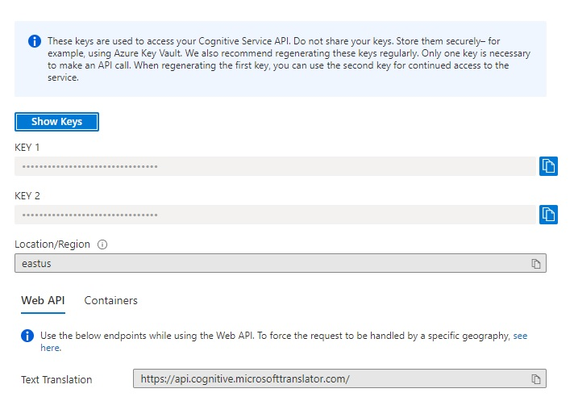

# Bag of Words

Bag of Words is an API that generates random words and also templates to be used on different platforms.
The word definitions are collected from the [Dictionary API](https://dictionaryapi.dev/)

Try it [here](https://4mz6hhf5ed.execute-api.us-east-1.amazonaws.com/dev/word).

## Requirements
* AWS Account
* Azure Account
* [Serverless](https://www.serverless.com/) framework
* NodeJS
* NPM or Yarn

## Config

### Azure Translator
It was used this translator because of the pricing limits
* Create a Translator in the [Azure Portal](https://portal.azure.com/)
* Specify the Resource Group, region, name, and pricing tier (select the F0)
* After the resource is created, access the "Keys and Endpoint"
* Copy the value of "KEY1" and add in the `MICROSOFT_TRANSLATOR_SUBSCRIPTION_KEY` in the `serverless.yml` file
* Fill the `MICROSOFT_TRANSLATOR_LOCATION` with the Location/Region
* Get the link of `Text Translation` and add in the `MICROSOFT_API_COGNITIVE_ENDPOINT`



## Install
Rename the file `serverless-copy.yml`to `serverless.yml`
```
# Install dependencies
npm i

# Install dev dependencies
npm i -D

```
## Test
[http://localhost:3000/dev/word/](http://localhost:3000/dev/word/)

```
//For testing is informing a single random word, but by default, the api will provide 3 words
{
    "words": [
        {
            "word": "Summer",
            "phonetic": "ˈsʌmə",
            "phonetics": [
                {
                    "text": "ˈsʌmə",
                    "audio": "//ssl.gstatic.com/dictionary/static/sounds/20200429/summer--_gb_1.mp3"
                }
            ],
            "origin": "Old English sumor, of Germanic origin; related to Dutch zomer, German Sommer, also to Sanskrit samā ‘year’.",
            "meanings": [
                {
                    "partOfSpeech": "noun",
                    "definitions": [
                        {
                            "definition": "the warmest season of the year, in the northern hemisphere from June to August and in the southern hemisphere from December to February.",
                            "example": "this plant flowers in late summer",
                            "synonyms": [],
                            "antonyms": []
                        }
                    ]
                },
                {
                    "partOfSpeech": "verb",
                    "definitions": [
                        {
                            "definition": "spend the summer in a particular place.",
                            "example": "well over 100 birds summered there in 1976",
                            "synonyms": [],
                            "antonyms": []
                        }
                    ]
                }
            ]
        }
    ]
}
```
### Specific language
[http://localhost:3000/dev/word/de](http://localhost:3000/dev/word/de)
```
//For this example it'll collect Deutsch random words
{
    "words": [
        {
            "word": "Schaden",
            "phonetic": "scháden",
            "phonetics": [
                {
                    "text": "scháden"
                }
            ],
            "origin": "mittelhochdeutsch schaden, althochdeutsch scadōn, zu Schaden",
            "meanings": [
                {
                    "partOfSpeech": "schwaches Verb",
                    "definitions": [
                        {
                            "definition": "für jemanden, etwas von Nachteil sein; einen Verlust, eine Beeinträchtigung darstellen, bewirken",
                            "example": "jemandem geschäftlich schaden",
                            "synonyms": [],
                            "antonyms": []
                        }
                    ]
                }
            ],
            "translation": {
                "text": "Hurt",
                "language": "en"
            }
        }
    ]
}

```
### Templates
* [Slack](http://localhost:3000/dev/word/template/slack)
```
{
    "blocks": [
        {
            "type": "section",
            "text": {
                "type": "mrkdwn",
                "text": "*Word*: Track\n*Example*: Secondary radars that track the aircraft in flight\n*Phonetics*: <https://ssl.gstatic.com/dictionary/static/sounds/20200429/track--_gb_1.mp3|Track>"
            }
        },
        {
            "type": "divider"
        },
        {
            "type": "section",
            "text": {
                "type": "mrkdwn",
                "text": "*Word*: Birth\n*Example*: She birthed five children within ten years\n*Phonetics*: <https://ssl.gstatic.com/dictionary/static/sounds/20200429/birth--_gb_1.mp3|Birth>"
            }
        },
        {
            "type": "divider"
        },
        {
            "type": "section",
            "text": {
                "type": "mrkdwn",
                "text": "*Word*: My\n*Example*: My goodness!\n*Phonetics*: <https://ssl.gstatic.com/dictionary/static/sounds/20200429/my--_gb_1.mp3|My>"
            }
        },
        {
            "type": "divider"
        }
    ]
}
```

## Deploy 
As this project was built with the serverless framework and the provider was set as `AWS`, the project will be deployed in the AWS.
```
npm run deploy
```

## Azure DevOps
